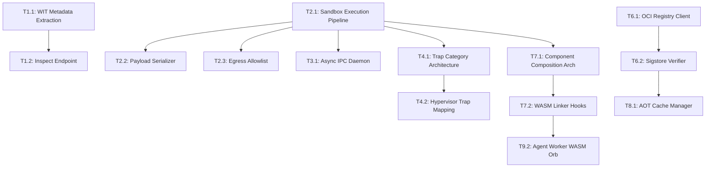

# Spinneret Product Backlog & Sprint Execution Plan

**Author:** Morpheus (Scrum Master)  
**Target Project:** Spinneret / Loom WebAssembly Hypervisor & Orchestrator  
**Source Documents:** `ROADMAP.md`, `PRD.md`, `ARCHITECTURE.md`, `architectural_suggestions.md`  

---

## 1. User Stories

### Phase 1: Core Execution & Daemon Integration

#### Story 1: Dynamic Interface Inspection & Schema Generation
* **Persona:** As an AI Orchestrator
* **Story:** I want to inspect a tool's interface without running it, so that I can automatically generate schema definitions for LLMs to use.
* **Acceptance Criteria:**
  1. The system accepts a tool identifier (remote or local).
  2. The system analyzes the tool's expected inputs and outputs without executing the tool.
  3. The system returns a structured schema format compatible with standard LLM function calling.
  4. Complex tools with multiple functions are fully mapped.

---

#### Story 2: Ephemeral Sandbox Launch with Fine-Grained Security Controls
* **Persona:** As an AI Orchestrator
* **Story:** I want to launch an isolated execution environment with strict resource and security limits, so that untrusted third-party tools can run safely.
* **Acceptance Criteria:**
  1. The system accepts a target tool, execution arguments, and security policies (CPU limits, memory caps, network rules).
  2. The tool executes strictly within the defined resource limits and network boundaries.
  3. The tool's output is returned cleanly to the orchestrator.
  4. Any tool output (standard out/error) is captured and returned without leaking into the host's console.

---

#### Story 3: Non-Blocking Execution Daemon
* **Persona:** As a Host Application Developer
* **Story:** I want the execution daemon to process requests concurrently, so that a long-running or stuck tool does not block the system from launching or managing other tools.
* **Acceptance Criteria:**
  1. Multiple execution requests can be submitted and processed simultaneously.
  2. Responses are matched to their corresponding requests even if they complete out of order.
  3. A tool that times out or runs infinitely does not impact the execution or response time of other parallel tools.
  4. Tool logs are perfectly isolated per request.

---

#### Story 4: Structured Error Recovery
* **Persona:** As a Host Application Developer
* **Story:** I want execution failures to be returned as categorized, structured data, so that I can build programmatic recovery workflows (like prompting a user for network permissions) instead of parsing text logs.
* **Acceptance Criteria:**
  1. Execution errors (e.g., out of memory, network blocked) are returned as categorized, structured objects.
  2. The host application can dynamically read the exact cause of the failure and metadata (e.g., the specific URL that was blocked).
  3. The system supports workflows where a failed execution can be retried after the host grants additional permissions.

---

#### Story 5: Automated Integration Test Suite
* **Persona:** As a Test Engineer
* **Story:** I want a comprehensive automated integration suite for the execution APIs, so that regressions in capability enforcement and security boundaries are caught before deployment.
* **Acceptance Criteria:**
  1. The system's execution APIs and daemon processes are tested end-to-end.
  2. Tests validate concurrent request handling and error payload structures.
  3. The test suite runs reliably in CI environments without complex external dependencies.

---

### Phase 2: Supply Chain Security & Component Composition

#### Story 6: Cryptographic Supply Chain Verification
* **Persona:** As a Security Engineer
* **Story:** I want the system to verify the cryptographic signatures of downloaded tools before execution, so that compromised or tampered tools cannot run in the environment.
* **Acceptance Criteria:**
  1. The system can authenticate to private and public tool registries.
  2. Downloaded tools are cryptographically verified against trusted identities and transparency logs.
  3. Any verification failure instantly halts execution before the tool is loaded or cached.

---

#### Story 7: Dynamic Tool Composition
* **Persona:** As an Agent Developer
* **Story:** I want tools to be able to securely invoke other tools within the sandbox environment, so that complex tasks can be completed securely without needing to constantly communicate back to the host orchestrator.
* **Acceptance Criteria:**
  1. The system can automatically resolve and download dependencies required by a tool.
  2. Tools can securely call functions from their dependent tools entirely within the isolated environment.
  3. Resource limits (CPU, memory) are enforced holistically across the entire chain of composed tools.

---

#### Story 8: Verified Local Tool Cache
* **Persona:** As a Platform Operator
* **Story:** I want the system to cache compiled tools securely, so that frequently used tools start instantly without compromising security checks.
* **Acceptance Criteria:**
  1. Compiled tools are stored locally for rapid startup.
  2. Cached files are verified for integrity (e.g., checksum validation) before every execution.
  3. Corrupted or invalid cache entries are automatically purged and the tool is re-fetched and re-verified.

---

#### Story 9: Isolated Agent Loop Execution
* **Persona:** As an AI Orchestrator
* **Story:** I want to run the entire LLM agent decision loop inside the secure sandbox, so that the agent's core logic is subject to the same strict resource and network controls as standard tools.
* **Acceptance Criteria:**
  1. An agent loop can execute securely within the sandbox.
  2. The agent is structurally denied raw network access and must use approved sub-tools to interact with the outside world.
  3. The system coordinates passing credentials and sub-tools to the isolated agent loop.

---

### Phase 3: Advanced Capabilities & Production Hardening

#### Story 10: Production Telemetry and Observability
* **Persona:** As an Infrastructure Engineer
* **Story:** I want the system to export standard metrics and traces, so that operators can monitor performance, resource utilization, and health in production environments.
* **Acceptance Criteria:**
  1. The system emits structured tracing for key lifecycle events (download, verification, execution).
  2. The system exposes standard metrics (e.g., active tools, resource consumption, cache hits).
  3. The daemon supports graceful shutdown, draining active executions safely.

---

#### Story 11: Local Developer CLI
* **Persona:** As a Tool Developer
* **Story:** I want a command-line interface to inspect, validate, and locally execute tools, so that I can rapidly iterate on tool development without deploying to a registry.
* **Acceptance Criteria:**
  1. Developers can inspect a tool's expected inputs and outputs locally.
  2. Developers can execute a tool locally with mock configurations and observe profiling data.
  3. Developers can validate that their tool conforms to the strict security and sandbox standards of the platform.


## 2. Tasks per Story

| Story | Task ID | Task Description | Owner | Branch Name | Dependencies |
| :--- | :--- | :--- | :--- | :--- | :--- |
| **Story 1** | T1.1 | Implement WIT metadata extraction in `loom` engine | Tank | `feat-1-wit-extractor` | None |
| | T1.2 | Implement `inspect_orb` endpoint in `spinneret` HTTP/IPC daemon | Apoc | `feat-1-inspect-endpoint` | T1.1 |
| | T1.3 | Add JSON Tool Schema formatter matching LLM specs | Switch | `feat-1-schema-formatter` | T1.1 |
| | T1.4 | Add schema extraction unit & integration tests | Mouse | `test-1-schema-tests` | T1.2, T1.3 |
| **Story 2** | T2.1 | Implement `Sandbox` execution pipeline & config binding in `loom` | Tank | `feat-2-sandbox-pipeline` | None |
| | T2.2 | Build WIT JSON payload argument parser & response serializer | Ghost | `feat-2-payload-serializer` | T2.1 |
| | T2.3 | Enforce `wasi:http` FQDN domain allowlist & WASI context scoping | Niobe | `sec-2-egress-allowlist` | T2.1 |
| | T2.4 | Add sandbox execution unit tests for fuel & memory traps | Mouse | `test-2-sandbox-traps` | T2.1, T2.2 |
| **Story 3** | T3.1 | Refactor `run_daemon` IPC loop to Tokio async task channel | Tank | `feat-3-async-ipc-daemon` | T2.1 |
| | T3.2 | Implement stdio stream isolation (`MemoryWritableStream`) in `Sandbox` | Dozer | `feat-3-stdio-isolation` | T2.1 |
| | T3.3 | Update `LocalExecutionRequest`/`Response` for JSON-RPC 2.0 `id` | Apoc | `feat-3-jsonrpc-id` | T3.1 |
| | T3.4 | Create concurrent IPC integration test verifying non-blocking execution | Mouse | `test-3-concurrent-ipc` | T3.1, T3.3 |
| **Story 4** | T4.1 | Design `TrapCategory` enum and error classification mappings | Architect | `arch-4-trap-category` | T2.1 |
| | T4.2 | Map Wasmtime traps to `TrapCategory` inside `loom` hypervisor | Tank | `feat-4-trap-mapping` | T4.1 |
| | T4.3 | Build TypeScript host OOP `SandboxError` hierarchy in Arachne client | Switch | `feat-4-ts-error-class` | T4.1 |
| | T4.4 | Implement dynamic recovery test suite for `NetworkBlocked` trap | Mouse | `test-4-trap-recovery` | T4.2, T4.3 |
| **Story 5** | T5.1 | Extract `crates/loom/tests/sandbox_tests.rs` test harness | Mouse | `test-5-loom-harness` | T2.1 |
| | T5.2 | Build E2E HTTP daemon API test suite (`POST /extrude`, `/inspect`) | Ghost | `test-5-http-daemon-tests` | T1.2, T2.2 |
| | T5.3 | Integrate E2E test harness into GitHub Actions workflow | Link | `ci-5-github-actions` | T5.1, T5.2 |
| **Story 6** | T6.1 | Implement `RegistryClient` module for OCI pulling & token auth | Link | `feat-6-oci-registry-client` | None |
| | T6.2 | Implement `SignatureVerifier` using `sigstore` crate | Niobe | `sec-6-sigstore-verifier` | T6.1 |
| | T6.3 | Perform security audit of Cosign verification & TOCTOU prevention | Cipher | `sec-6-cosign-audit` | T6.2 |
| **Story 7** | T7.1 | Design `ComponentComposer` module & WASM linker hook architecture | Architect | `arch-7-component-composer` | T2.1 |
| | T7.2 | Implement dynamic multi-component WASM linking in `loom` | Tank | `feat-7-wasm-linker-hooks` | T7.1 |
| | T7.3 | Build composite toolchaining integration test (`agent` -> `http-client`) | Ghost | `test-7-toolchaining` | T7.2 |
| **Story 8** | T8.1 | Implement `AotCache` disk manager (`serialize` / `deserialize_file`) | Tank | `feat-8-aot-cache-manager` | T2.1 |
| | T8.2 | Add SHA256 file checksum verification & corruption purge logic | Dozer | `feat-8-cache-integrity` | T8.1 |
| | T8.3 | Add Prometheus cache hit/miss metrics & performance benchmarks | Dozer | `feat-8-cache-metrics` | T8.1 |
| **Story 9** | T9.1 | Define `agent-worker` WIT interface & decision loop semantics | Oracle | `arch-9-agent-wit-spec` | T7.1 |
| | T9.2 | Implement `agent-worker` WASM component in `orbs/agent-worker` | Switch | `feat-9-agent-worker-orb` | T9.1, T7.2 |
| | T9.3 | Define multi-tool response schema formatting for host UI | Trinity | `feat-9-ui-response-schema` | T9.1 |
| **Story 10** | T10.1 | Inject OpenTelemetry tracing spans across hypervisor execution phases | Dozer | `feat-10-otel-tracing` | T2.1 |
| | T10.2 | Implement Prometheus metrics endpoint (`/metrics`) in daemon | Dozer | `feat-10-prometheus-metrics` | T10.1 |
| | T10.3 | Implement production Dockerfile, systemd unit, and security hardening | Link | `infra-10-daemon-hardening` | T10.2 |
| **Story 11** | T11.1 | Implement `loom-cli inspect` & `loom-cli run` subcommands | Apoc | `feat-11-cli-commands` | T1.1, T2.1 |
| | T11.2 | Implement `loom-cli validate` WASI Preview 2 component checker | Ghost | `feat-11-cli-validator` | T11.1 |

---

## 3. Critical Path

The critical path governs the minimal sequence of dependent technical tasks required to deliver a fully functional, zero-trust hypervisor:



* **Core Blockers:**
  1. `T2.1 (Sandbox Execution Pipeline)` blocks almost all downstream execution, IPC, error handling, and composition tasks.
  2. `T4.1 / T4.2 (Trap Category & Mapping)` blocks typed host error recovery.
  3. `T7.1 / T7.2 (Component Composition)` blocks untrusted agent execution (`Story 9`).
  4. `T6.1 / T6.2 (Sigstore Verification)` blocks production OCI distribution and TOCTOU defense.

---

## 4. Parallel Tracks

To maximize throughput and minimize lead time, team swarming is organized into three concurrent execution tracks once `T2.1` lands:

```
Track A (Core Engine & IPC Swarm)
  T1.1 (Tank) -> T1.2 (Apoc) -> T3.1 (Tank) -> T3.3 (Apoc) -> T8.1 (Tank)
  Owners: Tank, Apoc

Track B (Security, Trap Architecture & Verification)
  T2.3 (Niobe) -> T4.1 (Architect) -> T4.2 (Tank) -> T6.1 (Link) -> T6.2 (Niobe) -> T6.3 (Cipher)
  Owners: Niobe, Architect, Link, Cipher

Track C (Frontend, Toolchaining & Observability)
  T1.3 (Switch) -> T3.2 (Dozer) -> T4.3 (Switch) -> T7.1 (Architect) -> T9.1 (Oracle) -> T9.2 (Switch) -> T10.1 (Dozer)
  Owners: Switch, Dozer, Oracle, Trinity, Ghost
```

---

## 5. Risks & Mitigation Strategies

1. **Risk: Stdio Pollution Corrupting IPC Sidecar**
   * *Impact:* High. If a WASM component writes debug logs directly to `stdout`, it will corrupt the JSON-RPC pipe parsed by Electron/Python sidecar hosts.
   * *Mitigation:* `T3.2` explicitly pipes guest stdout/stderr into `wasmtime_wasi::pipe::MemoryWritableStream`, completely isolating guest I/O from host stdout.

2. **Risk: TOCTOU Attack via Local Cache Modification**
   * *Impact:* Critical. An attacker altering cached AOT binaries in `/var/lib/spinneret/cache` could bypass Sigstore verification.
   * *Mitigation:* `T8.2` enforces SHA256 integrity validation on disk prior to `Component::deserialize_file()`. Any checksum mismatch automatically purges the entry and re-executes OCI pull + Sigstore verification.

3. **Risk: Unbounded Memory & Fuel Burn in Composed Component Chains**
   * *Impact:* High. When `agent-worker` calls sub-tools via Component Composition, nested tools might consume separate fuel/memory quotas.
   * *Mitigation:* `T7.2` ensures the global `wasmtime::Store` fuel consumption and 50MB linear memory limit apply holistically to the entire execution store, including all composed component instances.

4. **Risk: Egress Allowlist Circumvention via IP Literal Navigation**
   * *Impact:* High. Untrusted Orbs attempting to bypass domain allowlists via raw IP addresses or DNS spoofing.
   * *Mitigation:* `T2.3` configures `SpinneretHttpHooks` to enforce strict FQDN host parsing and rejects raw IP addresses unless explicitly configured in `ExtrusionConfig`.

---

## 6. Definition of Done (DoD)

A user story is considered **Done** when all of the following conditions are fulfilled:

1. **Code Completeness:** All acceptance criteria are fully met and implemented in Rust / TypeScript.
2. **Standard Alignment:** Architectural recommendations (async IPC, stdio stream isolation, `Sandbox` nomenclature, typed traps) are respected.
3. **Automated Testing:** 
   * Unit test coverage >= 85% for newly added modules.
   * Integration tests in `crates/loom/tests/` pass cleanly without flaky execution.
   * `cargo test --workspace` succeeds without errors.
4. **Security & Performance Audit:**
   * Zero unhandled traps or uncaptured guest standard streams.
   * Sigstore verification passes keyless OIDC checks (for security stories).
   * Cold-start execution overhead measured and recorded.
5. **Code Review:** Approved by Smith (Code Reviewer) with zero unresolved blocking comments.
6. **Branch Hygiene:** Merged into `main` using standard GitHub Flow naming (`feat-{issue#}-{title}`, `sec-{issue#}-{title}`).

---

## Blog Entry

### Keeping the Threads Tight: Engineering Spinneret's Vertical Backlog

As Scrum Master for the Spinneret hypervisor team, my highest priority is maintaining a steady, uninterrupted flow of value from requirement to main branch. Over the past cycle, we took a hard look at our architectural blueprint and roadmap to translate abstract goals into crisp, actionable vertical user stories. The result is the document above—a battle plan designed to take Loom and Spinneret from foundational hypervisor primitives to a production-grade WebAssembly sandbox ecosystem.

What excites me most about this backlog is how directly it addresses our core design principles: zero-trust capability security, sub-millisecond cold starts, and seamless host ergonomics. By pairing our technical epics—like Tokio-driven async IPC streams, typed execution trap classification, and native Sigstore supply chain checks—with explicit owner assignments across our 16 team members, every specialist knows exactly where they swarm. Tank and Apoc are lined up to harden our non-blocking daemon IPC, Niobe and Cipher own our cryptographic boundaries, while Switch and Oracle drive our agent composition layer.

Our focus now shifts to execution. We've mapped out our critical path through task `T2.1` (the core Sandbox pipeline) and established three parallel swarming tracks to keep Work In Progress (WIP) minimal and lead time short. As capacity opens, team members pull the next prioritized task off the board, keeping our feedback loops tight and our builds green. Let's build the future of isolated WASM orchestration.

— *Morpheus, Scrum Master*
